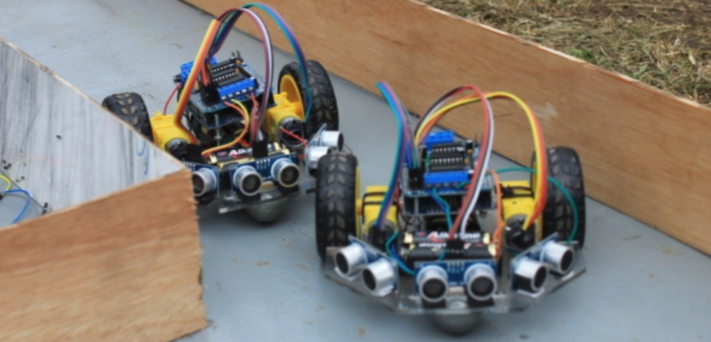

# Wall Follower Robot

A wall-following robot programmed using Arduino and the AFMotor library.

## Table of Contents

- [Description](#description)
- [Features](#features)
- [Requirements](#requirements)
- [Setup](#setup)
- [Usage](#usage)
- [Customization](#customization)
- [Acknowledgements](#acknowledgements)
- [License](#license)

## Description

This Arduino sketch implements the logic for a wall-following robot using ultrasonic sensors. The robot is designed to navigate while maintaining a certain distance from the surrounding walls.

## Features

- Wall-following behavior based on ultrasonic sensor readings.
- Motor control using the AFMotor library.
- Customizable speed settings and control intervals.

## Requirements

- Arduino board
- AFMotor library
- Ultrasonic sensors
- Motors and motor driver (compatible with AFMotor library)

## Setup

1. Connect the ultrasonic sensors to the specified pins (TRIG and ECHO).
2. Adjust motor pin configurations in the code according to your setup.
3. Upload the sketch to your Arduino board.
4. Power up the robot and observe its wall-following behavior.

## Usage

Ensure that the robot is placed in an environment with walls for it to navigate. The robot will autonomously follow the walls while avoiding collisions.

## Customization

- Adjust the motor speed settings (`SPEED_MAX`, `SPEED_MEDIUM`, `SPEED_MIN`) based on your robot's capabilities.
- Modify the control logic in the `logikaKontrol` function to customize the robot's behavior.

## Acknowledgements

This Wall Follower project is made by the C1 Hitech R&D Team.

## License

This project is licensed under the [MIT License](LICENSE).
